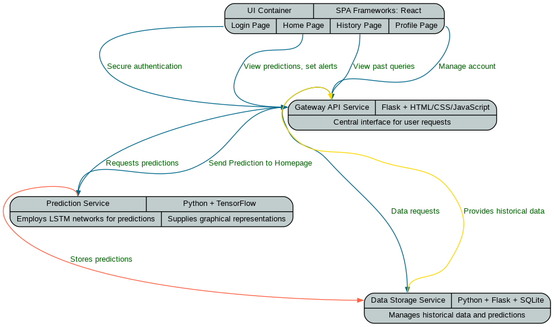

# ForEx Predictor

## Purpose
ForEx Predictor s aims to enhance decision-making for traders and businesses by offering predictive insights and actionable recommendations on currency exchange rate movements. This project, leveraging a microservices architecture with machine learning models and API integrations for real-time data, serves as a comprehensive tool for navigating the complexities of the foreign exchange market.

## Microservices Architecture

### Diagram


### UI Container
- **Responsibility:** Serves the frontend interface of CurrencyExchangeInsights, providing an intuitive and responsive user experience. It includes:
  - **Login Page**: Secure authentication for accessing user-specific insights and history.
  - **Home Page**: Central dashboard for currency predictions, real-time data viewing, and initiating new queries.
  - **History Page**: Displays a log of past queries and predictions, offering users insights into their past decisions.
  - **Profile Page**: Allows users to manage their account details and preferences.
- **Technologies:** Utilizes web technologies (HTML, CSS, JavaScript) for frontend development. The architecture supports SPA frameworks (e.g., React, Angular, Vue.js) for dynamic content delivery.

### Gateway API Service
- **Responsibility:** Acts as the central interface for user interactions, directing requests to the appropriate services. It serves the frontend, enabling users to view predictions, set alerts, and customize their experience.
- **Technologies:** Flask for the API; HTML/CSS/JavaScript for the frontend components.

### Prediction Service
- **Responsibility:** Employs LSTM (Long Short-Term Memory) networks for predicting future exchange rates based on historical data. Additionally, it generates and supplies graphical representations of predictions.
- **Technologies:** Python with TensorFlow or PyTorch for constructing and training machine learning models.

### Data Storage Service
- **Responsibility:** Handles storage and retrieval of historical data requests and prediction outcomes, supporting queries for historical information and managing user-generated history.
- **Technologies:** Python and Flask for creating RESTful services, SQLite for data persistence.

## Deployment
- **Containerization:** Docker is employed to containerize each microservice, ensuring isolated environments and dependency management.
- **Orchestration:** Kubernetes orchestrates the deployment, scaling, and management of containerized services, with Helm charts facilitating deployment configurations.

## Workflow
1. **User Interaction:** The Gateway API Service facilitates user requests for predictions, alerts, and system interactions through the frontend.
2. **Prediction Execution:** Continual model training within the Prediction Service enables the provision of updated exchange rate predictions and visualizations.
3. **Data Handling:** Historical and predictive data management is centralized within the Data Storage Service, ensuring dynamic and interactive content availability.

## Project Rubric Compliance

### Modular Services
- Showcases a microservices-based architecture with a clear division of responsibilities.

### Machine Learning/AI
- Applies sophisticated machine learning techniques for precise forecasting within the Prediction Service.

### Containers and Kubernetes
- Demonstrates cloud-native development and deployment best practices through the use of containerization and Kubernetes orchestration.

## Getting Started with Forex Predictor

This section provides detailed instructions on deploying and running the Forex Predictor application using Docker and Kubernetes. Ensure you have Docker, kubectl, and minikube (or any other Kubernetes cluster) installed on your system to proceed with the setup.

### Prerequisites
1. **Docker**: Install Docker on your system to create containers for each service.
2. **Kubernetes**: Install a Kubernetes cluster management tool, such as Minikube or use a cloud provider's Kubernetes service.
3. **kubectl**: Install kubectl to interact with your Kubernetes cluster.
4. **Helm**: Optionally, install Helm to manage Kubernetes charts easily.

### Deploying Forex Predictor
Follow these steps to deploy the Forex Predictor application on Kubernetes:

1. **Start Your Kubernetes Cluster**:
   - For Minikube: Run `minikube start` to initiate a local Kubernetes cluster.

2. **Clone the Repository**:
   - Clone this repository to your local machine to access the Kubernetes configuration files.
   ```bash
   git clone https://github.com/your-username/forex-predictor.git
   cd forex-predictor
   ```

3. **Load Docker Images**:
   - Build Docker images for each service or pull them from your registry.
   ```bash
   docker build -t forex-ui ./pages
   docker build -t forex-gateway ./gateway
   docker build -t forex-prediction ./prediction
   docker build -t forex-data-storage ./data-storage
   ```

4. **Deploy Services to Kubernetes**:
   - Apply the Kubernetes configurations:
   ```bash
   cd apps
   kubectl apply -f configmap.yaml
   kubectl apply -f data-storage-deployment.yaml
   kubectl apply -f data-storage-service.yaml
   kubectl apply -f gateway-deployment.yaml
   kubectl apply -f gateway-service.yaml
   kubectl apply -f prediction-deployment.yaml
   kubectl apply -f prediction-service.yaml
   kubectl apply -f ui-deployment.yaml
   kubectl apply -f ui-service.yaml
   kubectl apply -f fxp-ui-ingress.yaml
   ```

5. **Access the Application**:
   - Use `minikube service list` to find the IP and port of the UI service or check your cloud Kubernetes service dashboard.
   - Access the Forex Predictor UI via the provided URL in your browser.

### Monitoring and Logs
- Monitor the status of the pods and services using:
  ```bash
  kubectl get pods
  kubectl get services
  ```
- View logs for a specific service:
  ```bash
  kubectl logs <pod-name>
  ```

### Updating the Application
- To update any service, rebuild the Docker image and update the Kubernetes deployment:
  ```bash
  docker build -t forex-service:new ./path/to/service/Dockerfile
  kubectl set image deployment/forex-service forex-service=forex-service:new
  ```

### Cleaning Up
- To stop and remove all running services:
  ```bash
  kubectl delete all --all
  ```

This setup provides a robust foundation for running the Forex Predictor application in a production-like environment on Kubernetes.

## Contributing
We encourage contributions to CurrencyExchangeInsights. See our contributing guidelines for more details on participating.

## License
This project is licensed under the MIT License. Refer to the LICENSE file for details.

## Acknowledgments
Components and inspiration were drawn from these repositories:
- User Authentication: [Flask User Authentication](https://github.com/anuraagnagar/flask-user-authentication/tree/main)
- Frankfurter API: [Frankfurter](https://github.com/hakanensari/frankfurter)
